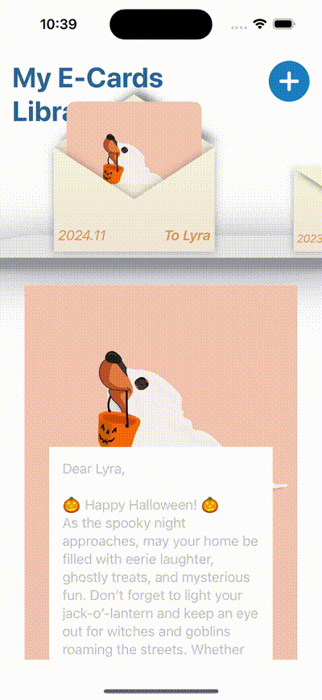
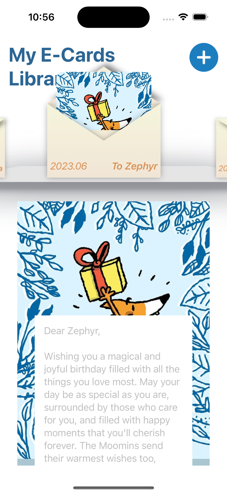

# eCards App UI

This project is a simple **SwiftUI** practice app that focuses on **animations**. It allows users to browse through their previously sent electronic cards in a library interface. Cards can be swiped left or right to navigate through the collection.

The animation implementation is inspired by [Kavsoft's eCard animation example](https://x.com/_Kavsoft/status/1537162776447025152), which demonstrates the use of SwiftUI animations in a vinyl record theme. 

## Features

- Browse previously sent eCards in a visually engaging UI.
- **Swipe gesture** navigation for smooth left/right browsing.
- Utilizes **SwiftUI animations** for dynamic transitions and interactions.
- Custom-designed **eCard envelope opening** effect to reveal the card details.
- Animation reference from [Kavsoft's eCard animation example](https://x.com/_Kavsoft/status/1537162776447025152).

## Screenshots

## Technologies Used

- **SwiftUI**: For building the user interface.
- **Swift**: The language used to implement app logic.
- **Animation**: Focus on creating interactive and smooth transitions.

## Future Improvements

- Allowing users to create and send new eCards directly from the app.

## Author

- **Alexandra Tsai** – Senior iOS Developer

Feel free to explore the code and contribute if you're interested!
